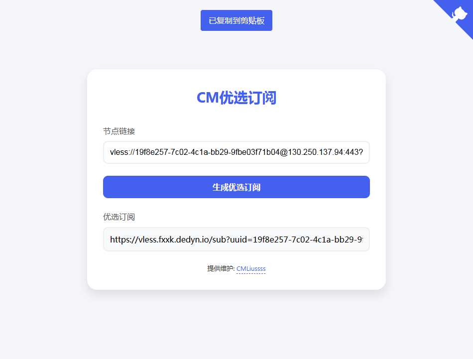

# 优选订阅生成器 WorkerVless2sub

这个是一个通过 Cloudflare Workers 搭建，自动化批量替换生成优选线路 VMess / VLESS / Trojan 节点的 **优选订阅生成器** [[实现原理]](https://www.youtube.com/watch?v=p-KhFJAC4WQ&t=70s)

注意！这是一个**公益服务项目**，请不要将私人节点放入`LINK`变量，这会让所有人都能获得此节点！！！

>Telegram交流群：[@CMLiussss](https://t.me/CMLiussss)，**感谢 [Alice Networks](https://alice.ws/aff.php?aff=15) 提供的云服务器维持 [CM订阅转换服务](https://sub.fxxk.dedyn.io/) ！**
# 部署方法
## Pages Github 部署 [视频教程](https://www.youtube.com/watch?v=p-KhFJAC4WQ&t=509s)
<details>
<summary><code><strong>「 Pages Github 部署方法 」</strong></code></summary>

### 1. 部署 Cloudflare Pages：
   - 在 Github 上先 Fork 本项目，并点上 Star !!!
   - 在 Cloudflare Pages 控制台中选择 `连接到 Git`后，选中 `WorkerVless2sub`项目后点击 `开始设置`。
     
### 2. 给 Pages绑定 自定义域：
   - 在 Pages控制台的 `自定义域`选项卡，下方点击 `设置自定义域`。
   - 填入你的自定义次级域名，注意不要使用你的根域名，例如：
     您分配到的域名是 `fuck.cloudns.biz`，则添加自定义域填入 `sub.fuck.cloudns.biz`即可；
   - 按照 Cloudflare 的要求将返回你的域名DNS服务商，添加 该自定义域 `sub`的 CNAME记录 `WorkerVless2sub.pages.dev` 后，点击 `激活域`即可。

### 3. 修改 快速订阅入口 以及 添加内置节点信息：

  例如您的pages项目域名为：`sub.fuck.cloudns.biz`；
   - 添加 `TOKEN` 变量，快速订阅访问入口，默认值为: `auto` ，获取订阅器默认节点订阅地址即 `/auto` ，例如 `https://sub.fuck.cloudns.biz/auto`；

**添加 VLESS 内置节点信息**
   - 添加 `HOST` 变量，例如 `edgetunnel-2z2.pages.dev`；
   - 添加 `UUID` 变量，例如 `30e9c5c8-ed28-4cd9-b008-dc67277f8b02`；
   - 添加 `PATH` 变量，例如 `/?ed=2560`；

**添加 Trojan 内置节点信息**
   - 添加 `HOST` 变量，例如 `hbpb.us.kg`；
   - 添加 `PASSWORD` 变量，例如 `bpb-trojan`；
   - 添加 `PATH` 变量，例如 `/tr?ed=2560`；

### 4. 添加你的专属优选线路：

   - 添加变量 `ADD`/`ADDNOTLS` 本地静态的优选线路，若不带端口号 TLS默认端口为443 / noTLS默认端口为80，#号后为备注别名，例如：
   ```
   icook.tw:2053#优选域名
   cloudflare.cfgo.cc#优选官方线路
   ```

   - 添加变量 `ADDAPI`/`ADDNOTLSAPI` 为 **优选IP地址txt文件** 的 URL。例如：
   ```url
   https://raw.githubusercontent.com/cmliu/WorkerVless2sub/main/addressesapi.txt
   https://raw.githubusercontent.com/cmliu/WorkerVless2sub/main/addressesipv6api.txt
   ```

   - 添加变量 `ADDCSV` 为 **iptest测速结果csv文件地址** 的 URL。例如：
   ```js
   https://raw.githubusercontent.com/cmliu/WorkerVless2sub/main/addressescsv.csv
   ```
   - 添加变量 `DLS` ，意为`ADDCSV`满足最低速度的要求，不满足改数值以上的IP将不会添加至优选订阅内容。注意：不考虑单位，只看数值，请按照您的测速结果而定。例如：
   ```js
   8
   ```

 </details>

## Workers 部署方法 [视频教程](https://youtu.be/AtCF7eq0hcE)

<details>
<summary><code><strong>「 Workers 部署方法 」</strong></code></summary>

### 1. 部署 Cloudflare Worker：

   - 在 Cloudflare Worker 控制台中创建一个新的 Worker。
   - 将 [worker.js](https://github.com/cmliu/WorkerVless2sub/blob/main/_worker.js)  的内容粘贴到 Worker 编辑器中。


### 2. 修改 快速订阅入口 以及 添加内置节点信息：

  例如您的workers项目域名为：`sub.cmliussss.workers.dev`；
   - 添加 `TOKEN` 变量，快速订阅访问入口，默认值为: `auto` ，获取订阅器默认节点订阅地址即 `/auto` ，例如 `https://sub.cmliussss.workers.dev/auto`；

**添加 VLESS 内置节点信息**
   - 添加 `HOST` 变量，例如 `edgetunnel-2z2.pages.dev`；
   - 添加 `UUID` 变量，例如 `30e9c5c8-ed28-4cd9-b008-dc67277f8b02`；
   - 添加 `PATH` 变量，例如 `/?ed=2560`；

**添加 Trojan 内置节点信息**
   - 添加 `HOST` 变量，例如 `hbpb.us.kg`；
   - 添加 `PASSWORD` 变量，例如 `bpb-trojan`；
   - 添加 `PATH` 变量，例如 `/tr?ed=2560`；

### 3. 添加你的专属优选线路：

**3.1 修改 addresses 参数示例**

 - 修改 `addresses` 参数添加本地静态的优选线路，若不带端口号默认443，不支持生成非TLS订阅，#号后为备注别名，例如：
	```js
	let addresses = [
		'icook.tw:2053#优选域名',
		'cloudflare.cfgo.cc#优选官方线路',
		'185.221.160.203:443#电信优选IP',
	];
	```
	该方式仅推荐添加优选域名的部分，频繁变更的优选推荐通过 `addressesapi` 来实现。


 **3.2 修改 addressesapi 参数示例**
 
 - 修改 `addressesapi` 参数，在脚本中设置 `addressesapi` 变量为 **优选IP地址txt文件** 的 URL。例如：
	```js
	let addressesapi = [
		'https://raw.githubusercontent.com/cmliu/WorkerVless2sub/main/addressesapi.txt',
 		'https://addressesapi.090227.xyz/CloudFlareYes',
	];
	```
	可参考 [addressesapi.txt](https://raw.githubusercontent.com/cmliu/WorkerVless2sub/main/addressesapi.txt) 内容格式 自行搭建。
 
  **3.3 修改 addressescsv 参数示例**
  
 - 修改 `addressescsv` 参数，在脚本中设置 `addressescsv` 变量为 **iptest测速结果csv文件地址** 的 URL。例如：
	```js
	let DLS = 4;//速度下限
	let addressescsv = [
		'https://raw.githubusercontent.com/cmliu/WorkerVless2sub/main/addressescsv.csv',
 		'https://raw.githubusercontent.com/cmliu/WorkerVless2sub/main/addressescsv.csv',
	];
	```
	`DLS` 为要求满足的最低速度，不满足改数值以上的IP将不会添加至优选订阅内容。注意：不考虑单位，只看数值，请按照您的测速结果而定。

 </details>

---

# 如何使用 [视频教程](https://youtu.be/OjqCKeEY7DQ)

  例如您的workers项目域名为：`sub.cmliussss.workers.dev`；
  
## 1. 快速订阅

   - 添加 `TOKEN` 变量，快速订阅访问入口，默认值为: `auto` ，获取订阅器默认节点订阅地址即 `/auto` ，例如：
     ```url
     https://sub.cmliussss.workers.dev/auto
     ```
     
## 2. 自定义订阅 

### **一键优选订阅**

  例如您的workers项目域名为：`sub.cmliussss.workers.dev`；
  - 打开项目域名，填入已接入CDN的节点链接后点击`生成优选订阅`即可。

### VLESS 手动订阅
   - **自定义订阅格式** `https://[你的Workers域名]/sub?host=[你的Vless域名]&uuid=[你的UUID]&path=[你的ws路径]`
   - **host**：您的 VLESS 伪装域名，例如 `edgetunnel-2z2.pages.dev`；
   - **uuid**：您的 VLESS 客户端 UUID，例如 `30e9c5c8-ed28-4cd9-b008-dc67277f8b02`；
   - **path**（可选）：您的 VLESS 路径（没有可留空不填），例如 `/?ed=2560`。
   - **sni**（可选）：您的 VLESS 的SNI（留空则默认同`host`），例如 `www.10068.cn`。
   - **type**（可选）：您的 VLESS 的传输协议（留空则默认为`ws`），例如 `splithttp`。
   - 自定义订阅地址如下：
     ```url
     https://sub.cmliussss.workers.dev/sub?host=edgetunnel-2z2.pages.dev&uuid=30e9c5c8-ed28-4cd9-b008-dc67277f8b02&path=/?ed=2560&sni=www.10068.cn&type=splithttp
     ```
   - 注意路径必须包含 "/sub"。

### Trojan 手动订阅
   - **自定义订阅格式** `https://[你的Workers域名]/sub?host=[你的Trojan域名]&pw=[你的password]&path=[你的ws路径]`
   - **host**：您的 Trojan 伪装域名，例如 `hbpb.us.kg`；
   - **uuid**：您的 Trojan 客户端 Password，例如 `bpb-trojan`；
   - **path**（可选）：您的 Trojan 路径（没有可留空不填），例如 `/tr?ed=2560`。
   - **sni**（可选）：您的 Trojan 的SNI（留空则默认同`host`），例如 `www.10068.cn`。
   - **type**（可选）：您的 Trojan 的传输协议（留空则默认为`ws`），例如 `splithttp`。
   - 自定义订阅地址如下：
     ```url
     https://sub.cmliussss.workers.dev/sub?host=hbpb.us.kg&pw=bpb-trojan&path=/tr?ed=2560
     ```
   - 注意路径必须包含 "/sub"。

## 3. 指定 clash、singbox 配置文件

   - 添加 `format=clash` 键值，获取 clash 订阅配置，例如：
     ```url
     https://sub.cmliussss.workers.dev/auto?format=clash
     https://sub.cmliussss.workers.dev/sub?format=clash&host=edgetunnel-2z2.pages.dev&uuid=30e9c5c8-ed28-4cd9-b008-dc67277f8b02&path=/?ed=2048
     ```
     
   - 添加 `format=singbox` 键值，获取 singbox 订阅配置，例如：
     ```url
     https://sub.cmliussss.workers.dev/auto?format=singbox
     https://sub.cmliussss.workers.dev/sub?format=singbox&host=edgetunnel-2z2.pages.dev&uuid=30e9c5c8-ed28-4cd9-b008-dc67277f8b02&path=/?ed=2048
     ```

----

# 变量说明
| 变量名 | 示例 | 备注 | 
|--------|---------|-----|
| TOKEN | `auto` | 快速订阅内置节点的订阅路径地址 /auto （支持多元素, 元素之间使用`,`或`换行`作间隔）| 
| HOST | `edgetunnel-2z2.pages.dev` | 快速订阅内置节点的伪装域名 （支持多元素, 订阅时随机获取, 元素之间使用`,`或`换行`作间隔） | 
| UUID | `b7a392e2-4ef0-4496-90bc-1c37bb234904` | 快速订阅内置VLESS节点的UUID （与变量`PASSWORD`冲突, 共存时优先使用`PASSWORD`） | 
| KEY | `token` | 动态UUID秘钥，使用变量`KEY`的时候，将不再启用变量`UUID`|
| TIME | `7` | 动态UUID有效时间（单位:天）|
| UPTIME | `3` | 动态UUID更新时间（默认:北京时间`3`点更新） |
| PASSWORD | `bpb-trojan` | 快速订阅内置Trojan节点的password （与变量`UUID`冲突, 共存时优先使用`PASSWORD`） | 
| PATH | `/?ed=2560` | 快速订阅内置节点的路径信息 | 
| SNI | `www.10068.cn` | 快速订阅内置节点的SNI信息（留空则默认同`host`） | 
| TYPE | `splithttp` | 快速订阅内置节点的传输协议信息（留空则默认为`ws`） | 
| ALPN | `h3` | Alpn（留空则默认为`http/1.1`） | 
| ADD | `icook.tw:2053#官方优选域名` | 对应`addresses`字段 （支持多元素, 元素之间使用`,`或`换行`作间隔） | 
| ADDAPI | [https://raw.github.../addressesapi.txt](https://raw.githubusercontent.com/cmliu/WorkerVless2sub/main/addressesapi.txt) | 对应`addressesapi`字段 （支持多元素, 元素之间使用`,`或`换行`作间隔） | 
| ADDNOTLS | `icook.hk:8080#官方优选域名` | 对应`addressesnotls`字段 （支持多元素, 元素之间使用`,`或`换行`作间隔） | 
| ADDNOTLSAPI | [https://raw.github.../addressesapi.txt](https://raw.githubusercontent.com/cmliu/CFcdnVmess2sub/main/addressesapi.txt) | 对应`addressesnotlsapi`字段 （支持多元素, 元素之间使用`,`或`换行`作间隔） | 
| ADDCSV | [https://raw.github.../addressescsv.csv](https://raw.githubusercontent.com/cmliu/WorkerVless2sub/main/addressescsv.csv) | 对应`addressescsv`字段 （支持多元素, 元素之间使用`,`或`换行`作间隔） | 
| DLS | `8` |`addressescsv`测速结果满足速度下限 | 
| NOTLS | `false` | 改为`true`, 将不做域名判断 始终返回noTLS节点 | 
| TGTOKEN | `6894123456:XXXXXXXXXX0qExVsBPUhHDAbXXXXXqWXgBA` | 发送TG通知的机器人token | 
| TGID | `6946912345` | 接收TG通知的账户数字ID | 
| SUBAPI | `subapi.fxxk.dedyn.io` | clash、singbox等 订阅转换后端 | 
| SUBCONFIG | [https://raw.github.../ACL4SSR_Online_Full_MultiMode.ini](https://raw.githubusercontent.com/cmliu/ACL4SSR/main/Clash/config/ACL4SSR_Online_Full_MultiMode.ini) | clash、singbox等 订阅转换配置文件 | 
| SUBNAME | `优选订阅生成器` | 订阅生成器名称 | 
| ICO | `https://raw.cmliussss.com/favicon.ico` | 网站图标 |
| PNG | `https://raw.cmliussss.com/img/CM512.png` | 网站LOGO | 
| IMG | `https://raw.cmliussss.com/keqing1080p.jpg` | 背景图片，多张图片将随机展示 （多元素`换行`作间隔） | 
| BEIAN | `提供维护: <a href='https://t.me/CMLiussss'>CMLiussss</a>` | 主页维护信息 | 
| SOCKS5DATA | [https://raw.github.../socks5Data](https://raw.githubusercontent.com/cmliu/WorkerVless2sub/main/socks5Data) | Socks5代理池 | 
| PS | `【请勿测速】` | 节点名备注消息 | 
| PROXYIP | `proxyip.fxxk.dedyn.io` | 默认分配的ProxyIP, 多ProxyIP将随机分配（支持多元素, 元素之间使用`,`或`换行`作间隔） | 
| CMPROXYIPS | `proxyip.aliyun.fxxk.dedyn.io#HK` | 识别HK后分配对应的ProxyIP（支持多元素, 元素之间使用`,`或`换行`作间隔） | 
| CFPORTS | `2053`,`2096`,`8443` | CF账户标准端口列表 |
| LINK | `vless://b7a39...`,`vmess://ew0K...`,`https://sub...` | 补充的**公益节点链接**（不要填入私用节点）, 可同时放入多个节点链接与多个订阅链接（支持多元素, 元素之间使用`,`或`换行`作间隔） |

----

## Star 星星走起
[](https://starchart.cc/cmliu/WorkerVless2sub)

# 致谢
[Alice Networks LTD](https://alice.ws/aff.php?aff=15)，[SAKURA-YUMI](https://github.com/SAKURA-YUMI)，[EzSync](https://github.com/EzSync)、[ACL4SSR](https://github.com/ACL4SSR/ACL4SSR/tree/master/Clash/config)、[3Kmfi6HP](https://github.com/6Kmfi6HP/EDtunnel/blob/main/.github/workflows/obfuscator.yml)


